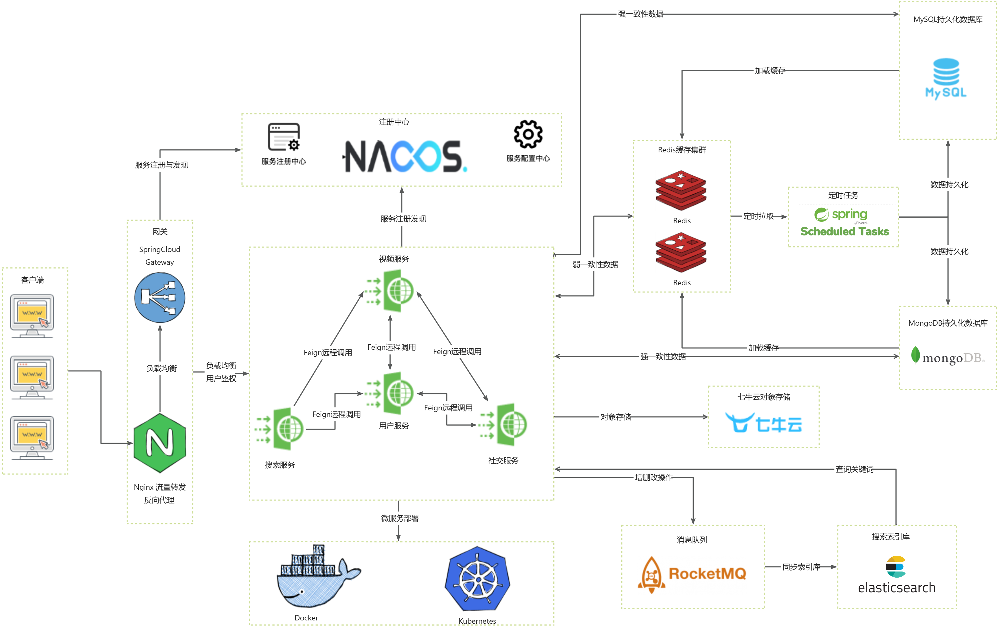

# 七牛云1024创作节 - 西南联大队 - AZAZ

## 项目介绍

本项目是**西南联大队**参加**七牛云1024创作节**的作品，项目名为AZAZ音视频，是一个基于七牛云的对象存储服务开发的分布式音视频网页软件项目，实现了视频观看、视频互动、用户社交等功能，并且在项目开发过程中考虑到了分布式、并发与高流量问题，大数据量下仍然能提供高效可靠的音视频服务。

## 项目架构

项目架构文档:[项目架构设计文档](docs/AZAZ音视频项目架构文档.md)



## 功能描述

功能需求文档：[AZAZ音视频功能需求文档](docs/AZAZ音视频功能需求文档.md)

## 项目快速启动

### 前端启动

#### 1. 进入azaz-page目录

```shell
cd /azaz/azaz-page
```

#### 2. 安装依赖，需要有node.js环境

```shell
npm install package-lock.json
```

#### 3. 修改后端请求地址
前端项目监听端口在vite.config.js中配置

后端网关请求地址在public\config.js中配置

#### 4. 编译项目

```shell
npm run build
```

#### 5. 运行项目
```shell
npm run dev
```

#### 6. 访问页面
在浏览器中输入 http://ip:port/AZAZ/#/  即可访问到主页面

### 后端启动

#### 1. 初始化MySQL数据库表结构

本项目的MySQL数据库表结构设计文档：[AZAZ数据库表结构设计](docs/AZAZ音视频数据库表结构设计文档.md)

可以使用路径 *resource/DB/azaz.sql* 的sql脚本快速生成表结构。

#### 2.初始化ElasticSearch索引库

本项目针对用户表和视频表建立了索引库，用来搜索用户名或者视频标题。

向ElasticSearch索引库添加Mapping映射的json语句在 *resource/ES* 路径下， 有*esmapping-user.json*与*esmapping-video.json*两个json文件, 分别用来建立用户与视频的索引映射。

#### 3. 克隆项目到本地

#### 4.部署项目中用到的中间件

本项目使用到的中间件及其版本如图所示:

| 中间件        | 版本   |
| ------------- | ------ |
| Qiniu对象存储 | 7.2.7  |
| MySQL         | 8.0.27 |
| Redis         | 6.2.6  |
| Nacos         | 2.03   |
| ElasticSearch | 7.12.1 |
| RocketMQ      | 4.5.1  |
| MongoDB       | 5.0.5  |

#### 5.配置中间件的地址端口用户名密码等

#### 6.依次启动各个服务

## Demo视频展示

b站地址：[AZAZ音视频项目演示DEMO](https://www.bilibili.com/video/BV1Y94y1V7FQ/?vd_source=bba7bdf72c37dd66fa65178812ffc8c4)

## TODO

### 1. 对用户进行分类

本项目中所有用户的信息都是按照一个套路进行处理，但是在实际的系统中会有活跃用户、非活跃用户、僵尸用户、粉丝量巨大的大V，普通用户等，如果所有信息统一处理，那么会比较消耗系统资源也不合理。所以后续改进中需要对用户进行分类，不同用户进行不同处理，活跃用户的信息可以常驻Redis,而非活跃用户则使用主动拉信息的模式，登录时才初始化缓存。

### 2. 对用户进行打标签，个性化推荐

本系统中由于各种限制，选择的视频流推送方式是按照时间顺序进行排序，在真实的系统中需要根据用户的喜好进行个性化推荐，需要根据用户常看视频完善用户画像，实现个性化推荐。同时也要尽可能保证用户看过的视频短时间内不会再次推荐给改用户。

### 3. 对视频进行分类

类似于用户信息，本系统中的视频信息也没有进行分类，后续应当将视频按照热度、点赞数、收藏数等数据分类，不同类型的数据进行不同的处理。


## 项目成员及分工

| 姓名   | 职责 | 分工                                                         |
| ------ | ---- | ------------------------------------------------------------ |
| 石功创 | 队长 | 分析整体架构；编写需求文档；设计数据库表结构；后端技术选型；编写接口文档；用户模块、社交模块、搜索模块的后端开发；说明文档编写；测试 |
| 陈彦希 | 队员 | 分析整体架构；辅助设计数据库表结构；后端技术选型；编写接口文档；视频模块的后端开发；说明文档编写；测试 |
| 杨博涵 | 队员 | 参与分析整体架构；前端技术选型；项目的前端开发；接口文档编写；辅助编写说明文档；测试 |

