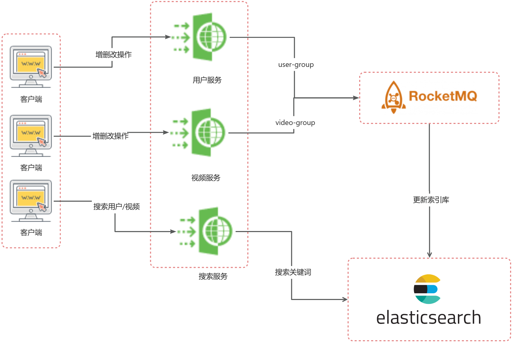

# 七牛云1024创作节 - 西南联大队 - AZAZ

## 项目介绍

本项目是**西南联大队**参加**七牛云1024创作节**的作品，项目名为AZAZ音视频，是一个基于七牛云的对象存储服务开发的分布式音视频网页软件项目，实现了视频观看、视频互动、用户社交等功能，并且在项目开发过程中考虑到了分布式、并发与高流量问题，大数据量下仍然能提供高效可靠的音视频服务。

## 项目架构

### 总览：

本项目采用前后端分离的架构，前端使用Vue框架，后端使用SpringBoot+SpringCloudAlibaba框架。使用到的中间件有MySQL，MongoDB，Redis，ElasticSearch，Nacos，RocketMQ等。

### 框架

本项目使用的后端框架为spring全家桶，框架版本对应为 jdk17 - springboot2.6.11 - springcloud2021.0.4 - springcloudalibaba2021.0.4.0 。

### 技术选型

#### 前端技术选型


#### 后端技术选型：

控制层与服务层框架选择：jdk17 - springboot2.6.11 - springcloud2021.0.4 - springcloudalibaba2021.0.4.0

持久层数据库选择：Qiniu对象存储，关系型数据库MySQL，非关系数据库Redis，文档型数据库MongoDB，消息通信中间件RocketMQ，搜索索引库ElasticSearch

### AZAZ音视频顶层技术选型设计


### AZAZ音视频项目架构


### AZAZ数据库表结构设计

#### 1. 项目数据库表一览

| 表名               | 表含义     | 备注                         |
| ------------------ | ---------- | ---------------------------- |
| tb_user            | 用户表     | 保存系统用户信息             |
| tb_video           | 视频表     | 保存视频信息                 |
| tb_like            | 点赞关系表 | 保存用户和视频的点赞关系对应 |
| tb_collect         | 收藏关系表 | 保存用户和视频的收藏关系对应 |
| tb_follow          | 关注关系表 | 保存用户和用户的关注关系对应 |
| tb_comment         | 评论表     | 保存用户对视频或者评论的回复 |
| tb_private_message | 私信信息表 | 保存用户与用户之间的私信     |

#### 2. 数据库表一览图


## 功能描述

### 接口文档地址

本项目的接口文档地址为：[ApiFox在线接口文档](https://apifox.com/apidoc/shared-c70f669d-dc50-47fd-8dab-250c85ee9d6b)

也可以使用路径 *resource/API/AZAZ音视频.openapi.json* 文档来生成，版本是openapi3.0

### 全部功能点及其描述

#### 用户模块

1. **用户注册**：用户提交手机和密码即可注册用户，系统会自动生成用户名与头像
2. **用户登录**：已注册用户可以通过手机号与密码登录系统
3. **用户信息查询**：用户可以在个人中心看到自己的个人信息，包括用户名、头像等
4. **用户信息修改**：用户可以个性化修改自己的头像、用户名等
5. **用户主页查询**：用户可以查看自己或者其他人的主页，信息包括用户名，粉丝数，关注数，获赞数，作品列表等

#### 视频模块

1. **获取视频流**：用户可以获取系统推荐的视频流
2. **只看某一分类的视频**：用户可以选择只看某一分类的视频
3. **发布视频**：用户可以上传视频，可以选择封面标题分类等等，分类有：1-直播 2-体育 3-游戏 4-番剧 5-知识 6-娱乐 7-美食 8-时尚 9-热点
4. **查看视频详细信息**：用户可以点击视频封面或者朋友推荐的视频查看详细信息
5. **点赞视频**：用户可以对视频进行点赞
6. **取消视频点赞**：用户可以取消对视频的点赞
7. **收藏视频**：用户可以收藏视频
8. **取消视频收藏**：用户可以取消对已收藏视频的收藏
9. **查询收藏列表**：用户可以查询自己的收藏列表
10. **查询用户作品数**：用户可以查询自己的作品数，展示在主页
11. **查询发布列表**：用户可以查询自己的作品
12. **查询用户获赞数**：用户可以在主页看到自己的获赞数。
13. **评论视频**：用户可以对视频发表评论
14. **回复评论**：用户可以回复评论
15. **获取评论列表**：用户可以查询视频的评论列表

#### 社交模块

1. **关注用户**：用户可以关注其他用户
2. **取消关注**：用户可以取消对其他用户的关注
3. **查询是否关注**：查询自己是否关注其他用户
4. **查询是否互关**：判断两个用户是否互相关注
5. **查询互关列表**：查询自己的互关列表，用于分享视频
6. **查询关注数**：查询自己关注的人数
7. **查询粉丝数**：查询自己的粉丝数
8. **查询关注列表**：查询自己关注用户的详细列表
9. **查询最近聊天列表**：查询自己最近聊天的朋友
10. **查询私聊历史记录**查询自己与某一个朋友的聊天记录
11. **发送私信**：向其他用户发送私信，未互关用户只能发送不超过三条消息
12. **分享视频**：用户可以向自己的互关朋友分享视频

#### 搜索模块

1. **用户搜索**：用户可以通过搜索框按照用户名的关键词检索用户
2. **视频搜索**：用户可以通过搜索框按照视频的标题的关键词检索视频

## 模块介绍

### 概览

项目的基本层级结构如下：

```shell
├── .idea
├── azaz-common # 通用包，包括常量类、通用工具、异常模型等
├── azaz-feign-api # OpenFeign远程调用
├── azaz-gateway # SpringCloud Gateway
├── azaz-model # 模型，包括dto，vo，pojo等
├── azaz-page # 前端页面
├── azaz-service # 实际的业务服务包
│   ├── azaz-interact # 社交服务
│   ├── azaz-search # 搜索服务
│   ├── azaz-user # 用户服务
│   └── azaz-video # 视频服务
├── pom.xml # pom依赖文件
├── project-log # logback日志
└── resource # 项目资源，包括启动sql等
```

本项目的服务基于业务逻辑进行纵向拆分，考虑到业务的关联程度我们将服务拆分成四个部分：**用户服务、视频服务、社交服务、搜索服务**。这种拆分方法充分考虑到了自洽性与扩展性，各自与数据库表对应，实现高内聚低耦合以及代码复用，也利于后期进行扩展。

### 用户模块

#### 1. 项目层级结构

```shell
├── pom.xml # pom依赖文件
└── src # 项目源文件
    └── main
        ├── java
        │   └── com
        │       └── azaz
        │           ├── UserApplication.java # 用户服务启动类
        │           ├── config # 配置包
        │           │   ├── MybatisConfig.java # MybatisPlus配置
        │           │   ├── RedissonConfig.java # Redisson配置
        │           │   └── WebMvcConfiguration.java # SpringMVC配置
        │           ├── controller # 控制包
        │           │   ├── UserInfoController.java # 用户信息控制
        │           │   └── UserLoginController.java # 用户登录注册控制
        │           ├── interceptor # 拦截器
        │           │   └── TokenInterceptor.java # token拦截器
        │           ├── mapper # 持久层
        │           │   ├── UserLoginMapper.java
        │           │   └── UserMapper.java
        │           └── service # 服务层
        │               ├── UserInfoService.java  # 用户信息服务接口
        │               ├── UserLoginService.java # 用户登录注册服务接口
        │               └── impl
        │                   ├── UserInfoServiceImpl.java # 用户信息服务接口实现类
        │                   └── UserLoginServiceImpl.java # 用户登录注册服务接口实现类
        └── resources
            ├── application.yml # 中间件日志等配置
            ├── bootstrap.yaml # nacos配置
            ├── logback.xml # 日志配置
            └── mapper # Mybatis的xml文件
```

#### 2. 实体设计

用户实体设计如下：

```java
@TableName("tb_user")
public class User {
    /**
     * 用户id,采用数据库自增
     */
    @TableId(type = IdType.AUTO)
    private Long id;
    /**
     * 手机号，唯一
     */
    @TableField("phone")
    private String phone;
    /**
     * 用户名
     */
    @TableField("username")
    private String username;

    /**
     * 密码
     */
    @TableField("password")
    private String password;
    /**
     * 盐
     */
    @TableField("salt")
    private String salt;

    /**
     * 用户头像url
     */
    @TableField("image")
    private String image;

    /**
     * 用户个性签名
     */
    @TableField("signature")
    private String signature;

    /**
     * 用户状态，0 正常，1 禁用
     */
    @TableField("status")
    private Integer status;

    /**
     * 用户关注数
     */
    @TableField("attention")
    private Integer attention;

    /**
     * 用户粉丝数
     */
    @TableField("followers")
    private Integer followers;

    /**
     * 用户作品数
     */
    @TableField("works")
    private Integer works;

    /**
     * 用户获赞数
     */
    @TableField("likes")
    private Integer likes;
    /**
     * 创建时间
     */
    @TableField("create_time")
    private LocalDateTime createTime;
    
    /**
     * 更新时间
     */
    @TableField("update_time")
    private LocalDateTime updateTime;
}
```

#### 3. 重点功能设计

用户模块主要负责以用户为中心的功能部分，包括用户注册、用户登录、用户信息查询等。

**用户注册**

在用户注册功能中，需要考虑到手机号是否合法、是否重复注册等情况。由于账户信息是最重要的数据之一，所以在校验参数的同时，还需要考虑到并发注册的问题，即同一时刻有多个手机号进入注册账号的代码块导致数据库插入出错或者其他错误。


本系统在注册过程中，使用**Redisson对手机号进行加锁**，保证同一时刻同一个手机号只能有一个线程进入注册的逻辑，保证账户的唯一性的同时也避免出现插入出错。

**用户信息修改**

在本项目中，用户信息的修改不仅仅涉及到数据库与缓存，还涉及到搜索索引库，因为**用户名需要被搜索**。所以在用户修改了账户数据后，需要将索引库也进行更新，考虑到性能与用户体验，本系统采用RocketMQ异步通信的方式告知ES服务更新索引库。


**用户信息查询**

在本系统的视频场景中，用户信息查询较为频繁，而本系统中将用户信息分为两种：

第一种是在评论区、视频界面、关注列表展示等出现的用户数据，这一类用户数据只包括头像昵称，属于不常变化的简略信息，并且这部分数据会查询得极为频繁；需要在Redis中进行缓存避免大量数据库请求。

另外一种就是查询用户主页，这种数据不仅包括第一种简略数据，还包括关注人数，粉丝数作品数等详细数据信息，这种数据需要点击用户主页才会被查询，属于不那么频繁的请求。该类数据需要向对应的服务发起远程调用，将得到数据结果与基本信息进行组合返回给用户。

将两种信息分开，可以避免许多无用的数据的查询与传输，大大减少了网络IO，也减少了第一种信息查询的时间，优化用户体验。

### 视频模块

#### 1.项目层级结构

```shell
├── pom.xml # pom依赖文件
└── src # 项目源文件
    └── main
        ├── java
        │   └── com
        │       └── azaz
        │           ├── VideoApplication.java # 视频服务启动类
        │           ├── config # 配置包
        │           │   ├── MybatisConfig.java #  
        │           │   ├── RedissonConfig.java
        │           │   └── WebMvcConfiguration.java
        │           ├── controller # 控制包
        │           │   └── VideoController.java # 视频控制
        │           ├── interceptor # 拦截器包
        │           │   └── TokenInterceptor.java # token拦截器
        │           ├── mapper # 持久层
        │           │   ├── CommentMapper.java
        │           │   └── VideoMapper.java
        │           └── service # 服务包
        │               ├── DbOpsService.java # mongoDB操作服务
        │               ├── VideoDoLikeService.java # 点赞收藏服务
        │               ├── VideoUploadService.java # 视频发布服务
        │               └── impl
        │                   ├── DbOpsServiceImpl.java # mongoDB操作服务实现类
        │                   ├── VideoDoLikeServiceImpl.java # 点赞收藏服务实现类
        │                   └── VideoUploadServiceImpl.java # 视频发布服务实现类
        └── resources
            ├── application.yml # 中间件日志等配置
            ├── bootstrap.yaml # nacos配置
            ├── logback.xml # 日志配置
            └── mapper # Mybatis的xml文件
```

#### 2. 实体设计

视频实体

评论实体

#### 3. 重点功能设计


### 社交模块

#### 1.项目层级结构

```shell
├── pom.xml # pom依赖文件
└── src # 项目源文件
    └── main
        ├── java
        │   └── com
        │       └── azaz
        │           ├── InteractApplication.java # 社交服务启动类
        │           ├── config # 配置包
        │           │   ├── MybatisConfig.java # MybatisPlus配置
        │           │   ├── RedissonConfig.java # Redisson配置
        │           │   └── WebMvcConfiguration.java # SpringMVC配置
        │           ├── controller # 控制包
        │           │   ├── PrivateMessageController.java # 私信控制
        │           │   └── UserFollowController.java # 关注控制
        │           ├── interceptor # 拦截器包
        │           │   └── TokenInterceptor.java # token拦截器
        │           ├── mapper # 持久层包
        │           │   ├── FollowMapper.java
        │           │   └── PrivateMessageMapper.java
        │           ├── mq # RocketMQ消息队列
        │           │   └── PrivateMessageListener.java # 监听消息发送
        │           └── service # 服务包
        │               ├── PrivateMessageService.java # 私信服务
        │               ├── UserFollowService.java # 关注服务
        │               └── impl 
        │                   ├── PrivateMessageServiceImpl.java # 私信服务实现类
        │                   └── UserFollowServiceImpl.java # 关注服务实现类
        └── resources
            ├── application.yml # 中间件日志等配置
            ├── bootstrap.yaml # nacos配置
            ├── logback.xml # 日志配置
            └── mapper # Mybatis的xml文件
```

#### 2. 实体设计

私信实体设计如下：

```java
@TableName("tb_private_message")
public class PrivateMessage {
    /**
     * 私信id
     */
    @TableId(type = IdType.AUTO)
    private Long id;

    /**
     * 发送者id
     */
    @TableField("sender_id")
    private Long senderId;

    /**
     * 接收者id
     */
    @TableField("receiver_id")
    private Long receiverId;
    /**
     * 私信类型，0-默认 1-朋友分享的视频 2-系统消息
     */
    @TableField("message_type")
    private Integer messageType;

    /**
     * 私信内容
     */
    @TableField("message_content")
    private String messageContent;

    /**
     * 私信状态，0-正常 1-删除
     */
    @TableField("status")
    private Integer status;

    /**
     * 创建时间
     */
    @TableField("create_time")
    private LocalDateTime createTime;
}
```

#### 3. 重点功能设计

**关注功能**

关注数据是本系统中比较重要的数据，要尽最大的可能保证数据不丢失以及一致性。

+ 数据库设计

为了达到数据不丢失的目标，系统中用户进行关注/取关操作时，会**立即将数据插入MySQL数据库持久化到磁盘**。可以这么做的理由是相比点赞动作的随意与不经心，关注/取关操作一般是有思考之后的结果，所以不会很频繁，一个用户每天新增的关注数据不会很多甚至没有，所以更改完全可以马上持久化到磁盘，查询时使用缓存。

在数据层，用户之间的关注数据是保存在一个关注关系表中，表中有三个重要字段：**主键id、操作关注用户userId、被关注用户followId**。在这三个字段建好索引即可大大提高查询效率。

+ 缓存设计

当用户点击自己的主页或者他人的主页时，会显示对方的关注人数与粉丝数，同时根据用户本人是否关注对方还会有不同状态的关注按钮。

为了实现第一个功能展示关注人数与粉丝数，我们在Redis中以 前缀+用户id 为key，用户的 关注数/粉丝数 为value保存数据，**增加修改与查询的效率**。对于key的过期时间，由于只需要保存一个数字，占用较小，所以可以设置key永不过期。

而第二个是否关注对方的功能则需要判断对应的userId与followId组合在数据库中是否存在，由于点进对方主页是一个较为频繁的操作，所以这种操作不能在数据库进行，于是考虑到种种因素，本系统选择Redis中的Set数据结构来存储某个用户关注的所有人数：Set数据结构的不重复的特性保证**不会出现重复关注同一个用户的情况，而且使用isMember()函数可以快速判断对方是否在自己的关注列表之中。**而之所以保存某个用户的关注列表而不是保存粉丝列表则是因为大V可能有非常多的粉丝而一个人关注的其他人数则会非常有限，**保存用户的关注列表可以有效分散数据到不同的key提高效率**。

+ 唯一性设计

为了防止某用户频繁点击关注按钮关注取关或者并发发起关注请求，关注用户的代码块同样使用**Redisson分布式锁对用户id进行加锁**。

+ 崩溃恢复

由于点赞数据的新增与修改都会立即持久化到数据库，所以即使Redis发生崩溃，也可以从数据库中恢复数据。

**私信功能**

### 搜索模块

#### 1.项目层级结构

```shell
├── pom.xml # pom依赖文件
└── src # 项目源文件
    └── main
        ├── java
        │   └── com
        │       └── azaz
        │           ├── SearchApplication.java # 搜索服务启动类
        │           ├── config # 配置包
        │           │   ├── ElasticSearchConfig.java # ElasticSearch配置
        │           │   ├── MybatisConfig.java # MybatisPlus配置
        │           │   └── WebMvcConfiguration.java # SpringMVC配置
        │           ├── controller # 控制包
        │           │   └── SearchController.java # 搜索控制
        │           ├── interceptor # 过滤器
        │           │   └── TokenInterceptor.java #token过滤器
        │           ├── mq # RocketMQ消费者
        │           │   ├── UserInfoListener.java # 监听用户信息的增删改
        │           │   └── VideoPublishListener.java # 监听视频信息的增删改
        │           └── service # 服务包
        │               ├── SearchService.java # 搜索服务接口
        │               └── impl
        │                   └── SearchServiceImpl.java # 搜索服务接口实现类
        └── resources
            ├── application.yml # 中间件日志等配置
            ├── bootstrap.yaml # nacos配置
            ├── logback.xml # 日志配置
            └── mapper # Mybatis的xml文件
```

#### 2. 重点功能设计

**搜索功能**

搜索功能使用ElasticSearch倒排索引库，分为用户名索引库与视频标题索引库，所以索引库的新增更新删除都依赖于用户服务与视频服务，在本系统中两者与搜索服务的通信采用RocketMQ的异步消息。



## TODO

## 项目快速启动

### 前端启动


### 后端启动

#### 1. 初始化MySQL数据库表结构

本项目的MySQL数据库表结构设计文档地址：[AZAZ数据库表结构设计](https://sqrmcnsjwo8.feishu.cn/docx/HOVZdtwVDorY2TxNSL1cYBlynLb?from=from_copylink)

可以使用路径 *resource/DB/azaz.sql* 的sql脚本快速生成表结构。

#### 2.初始化ElasticSearch索引库

本项目针对用户表和视频表建立了索引库，用来搜索用户名或者视频标题。

向ElasticSearch索引库添加Mapping映射的json语句在 *resource/ES* 路径下， 有*esmapping-user.json*与*esmapping-video.json*两个json文件, 分别用来建立用户与视频的索引映射。

#### 3. 克隆项目到本地

#### 4.部署项目中用到的中间件

本项目使用到的中间件及其版本如图所示:

| 中间件        | 版本   |
| ------------- | ------ |
| Qiniu对象存储 | 7.2.7  |
| MySQL         | 8.0.27 |
| Redis         | 6.2.6  |
| Nacos         | 2.03   |
| ElasticSearch | 7.12.1 |
| RocketMQ      | 4.5.1  |
| MongoDB       | 5.0.5  |

#### 5.配置中间件的地址端口用户名密码等

#### 6.依次启动各个服务

## Demo视频展示


## 项目成员及分工

| 姓名   | 职责 | 分工                                                         |
| ------ | ---- | ------------------------------------------------------------ |
| 石功创 | 队长 | 分析整体架构；编写需求文档；设计数据库表结构；后端技术选型；编写接口文档；用户模块、社交模块、搜索模块的后端开发；说明文档编写；测试 |
| 陈彦希 | 队员 | 分析整体架构；辅助设计数据库表结构；后端技术选型；编写接口文档；视频模块的后端开发；说明文档编写；测试 |
| 杨博涵 | 队员 | 参与分析整体架构；前端技术选型；项目的前端开发；接口文档编写；辅助编写说明文档；测试 |

