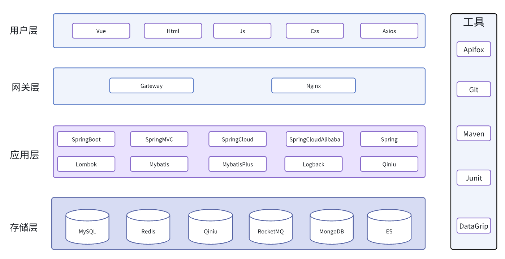
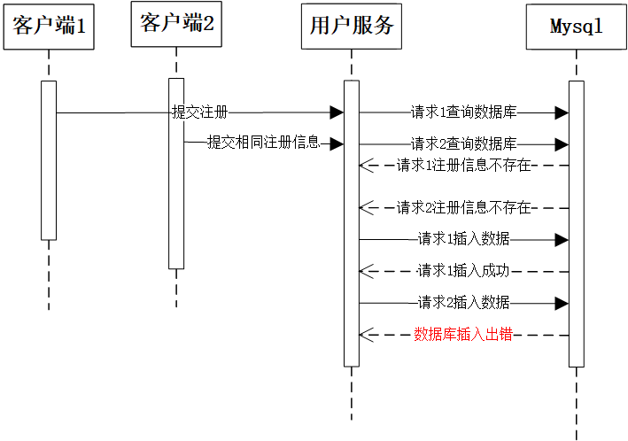
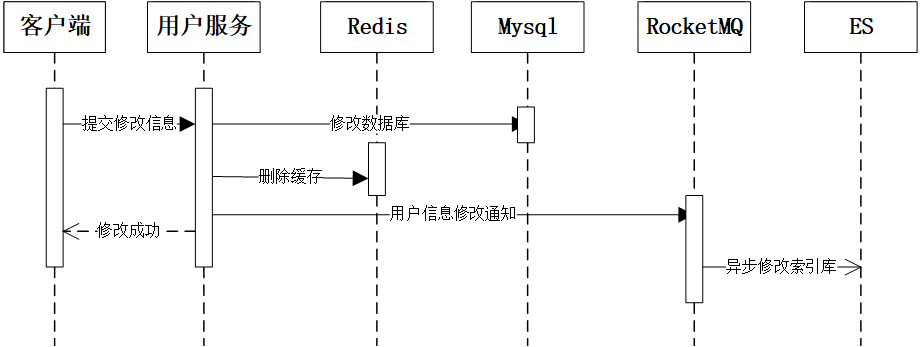
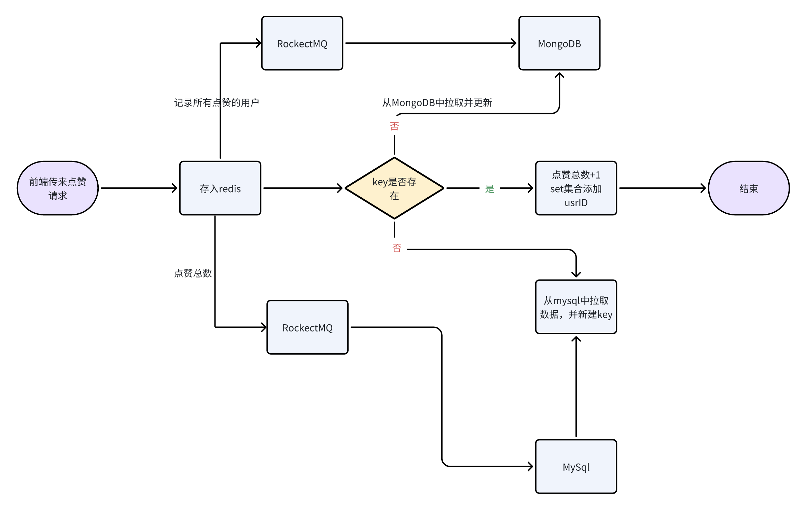
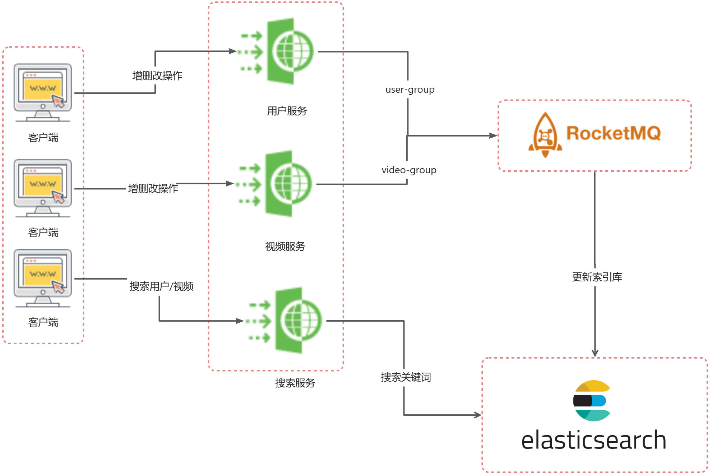

# AZAZ项目架构文档

## 总览：

本项目采用前后端分离的架构，前端使用Vue框架，后端使用SpringBoot+SpringCloudAlibaba框架。使用到的中间件有MySQL，MongoDB，Redis，ElasticSearch，Nacos，RocketMQ等。

## 框架

本项目使用的后端框架为spring全家桶，框架版本对应为 jdk17 - springboot2.6.11 - springcloud2021.0.4 - springcloudalibaba2021.0.4.0 。

## 技术选型

#### 前端技术选型

前端使用js + html + css技术栈，框架选用Vue。

#### 后端技术选型：

控制层与服务层框架选择：jdk17 - springboot2.6.11 - springcloud2021.0.4 - springcloudalibaba2021.0.4.0

持久层数据库选择：Qiniu对象存储，关系型数据库MySQL，非关系数据库Redis，文档型数据库MongoDB，消息通信中间件RocketMQ，搜索索引库ElasticSearch

## AZAZ音视频顶层技术选型设计



## AZAZ音视频项目架构


## 模块介绍

### 概览

项目的基本层级结构如下：

```shell
├── .idea
├── azaz-common # 通用包，包括常量类、通用工具、异常模型等
├── azaz-feign-api # OpenFeign远程调用
├── azaz-gateway # SpringCloud Gateway
├── azaz-model # 模型，包括dto，vo，pojo等
├── azaz-page # 前端页面
├── azaz-service # 实际的业务服务包
│   ├── azaz-interact # 社交服务
│   ├── azaz-search # 搜索服务
│   ├── azaz-user # 用户服务
│   └── azaz-video # 视频服务
├── pom.xml # pom依赖文件
├── project-log # logback日志
└── resource # 项目资源，包括启动sql等
```

本项目的服务基于业务逻辑进行纵向拆分，考虑到业务的关联程度我们将服务拆分成四个部分：**用户服务、视频服务、社交服务、搜索服务**。这种拆分方法充分考虑到了自洽性与扩展性，各自与数据库表对应，实现高内聚低耦合以及代码复用，也利于后期进行扩展。

### 用户模块

#### 1. 项目层级结构

```shell
├── pom.xml # pom依赖文件
└── src # 项目源文件
    └── main
        ├── java
        │   └── com
        │       └── azaz
        │           ├── UserApplication.java # 用户服务启动类
        │           ├── config # 配置包
        │           │   ├── MybatisConfig.java # MybatisPlus配置
        │           │   ├── RedissonConfig.java # Redisson配置
        │           │   └── WebMvcConfiguration.java # SpringMVC配置
        │           ├── controller # 控制包
        │           │   ├── UserInfoController.java # 用户信息控制
        │           │   └── UserLoginController.java # 用户登录注册控制
        │           ├── interceptor # 拦截器
        │           │   └── TokenInterceptor.java # token拦截器
        │           ├── mapper # 持久层
        │           │   ├── UserLoginMapper.java
        │           │   └── UserMapper.java
        │           └── service # 服务层
        │               ├── UserInfoService.java  # 用户信息服务接口
        │               ├── UserLoginService.java # 用户登录注册服务接口
        │               └── impl
        │                   ├── UserInfoServiceImpl.java # 用户信息服务接口实现类
        │                   └── UserLoginServiceImpl.java # 用户登录注册服务接口实现类
        └── resources
            ├── application.yml # 中间件日志等配置
            ├── bootstrap.yaml # nacos配置
            ├── logback.xml # 日志配置
            └── mapper # Mybatis的xml文件
```

#### 2. 实体设计

用户实体设计如下：

```java
@TableName("tb_user")
public class User {
    /**
     * 用户id,采用数据库自增
     */
    @TableId(type = IdType.AUTO)
    private Long id;
    /**
     * 手机号，唯一
     */
    @TableField("phone")
    private String phone;
    /**
     * 用户名
     */
    @TableField("username")
    private String username;

    /**
     * 密码
     */
    @TableField("password")
    private String password;
    /**
     * 盐
     */
    @TableField("salt")
    private String salt;

    /**
     * 用户头像url
     */
    @TableField("image")
    private String image;

    /**
     * 用户个性签名
     */
    @TableField("signature")
    private String signature;

    /**
     * 用户状态，0 正常，1 禁用
     */
    @TableField("status")
    private Integer status;

    /**
     * 用户关注数
     */
    @TableField("attention")
    private Integer attention;

    /**
     * 用户粉丝数
     */
    @TableField("followers")
    private Integer followers;

    /**
     * 用户作品数
     */
    @TableField("works")
    private Integer works;

    /**
     * 用户获赞数
     */
    @TableField("likes")
    private Integer likes;
    /**
     * 创建时间
     */
    @TableField("create_time")
    private LocalDateTime createTime;
    
    /**
     * 更新时间
     */
    @TableField("update_time")
    private LocalDateTime updateTime;
}
```

#### 3. 重点功能设计

用户模块主要负责以用户为中心的功能部分，包括用户注册、用户登录、用户信息查询等。

**用户注册**

在用户注册功能中，需要考虑到手机号是否合法、是否重复注册等情况。由于账户信息是最重要的数据之一，所以在校验参数的同时，还需要考虑到并发注册的问题，即同一时刻有多个手机号进入注册账号的代码块导致数据库插入出错或者其他错误。



本系统在注册过程中，使用**Redisson对手机号进行加锁**，保证同一时刻同一个手机号只能有一个线程进入注册的逻辑，保证账户的唯一性的同时也避免出现插入出错。

**用户信息修改**

在本项目中，用户信息的修改不仅仅涉及到数据库与缓存，还涉及到搜索索引库，因为**用户名需要被搜索**。所以在用户修改了账户数据后，需要将索引库也进行更新，考虑到性能与用户体验，本系统采用RocketMQ异步通信的方式告知ES服务更新索引库。



**用户信息查询**

在本系统的视频场景中，用户信息查询较为频繁，而本系统中将用户信息分为两种：

第一种是在评论区、视频界面、关注列表展示等出现的用户数据，这一类用户数据只包括头像昵称，属于不常变化的简略信息，并且这部分数据会查询得极为频繁；需要在Redis中进行缓存避免大量数据库请求。

另外一种就是查询用户主页，这种数据不仅包括第一种简略数据，还包括关注人数，粉丝数作品数等详细数据信息，这种数据需要点击用户主页才会被查询，属于不那么频繁的请求。该类数据需要向对应的服务发起远程调用，将得到数据结果与基本信息进行组合返回给用户。

将两种信息分开，可以避免许多无用的数据的查询与传输，大大减少了网络IO，也减少了第一种信息查询的时间，优化用户体验。

### 视频模块

#### 1.项目层级结构

```shell
├── pom.xml # pom依赖文件
└── src # 项目源文件
    └── main
        ├── java
        │   └── com
        │       └── azaz
        │           ├── VideoApplication.java # 视频服务启动类
        │           ├── config # 配置包
        │           │   ├── MybatisConfig.java #  
        │           │   ├── RedissonConfig.java
        │           │   └── WebMvcConfiguration.java
        │           ├── controller # 控制包
        │           │   └── VideoController.java # 视频控制
        │           ├── interceptor # 拦截器包
        │           │   └── TokenInterceptor.java # token拦截器
        │           ├── mapper # 持久层
        │           │   ├── CommentMapper.java
        │           │   └── VideoMapper.java
        │           └── service # 服务包
        │               ├── DbOpsService.java # mongoDB操作服务
        │               ├── VideoDoLikeService.java # 点赞收藏服务
        │               ├── VideoUploadService.java # 视频发布服务
        │               └── impl
        │                   ├── DbOpsServiceImpl.java # mongoDB操作服务实现类
        │                   ├── VideoDoLikeServiceImpl.java # 点赞收藏服务实现类
        │                   └── VideoUploadServiceImpl.java # 视频发布服务实现类
        └── resources
            ├── application.yml # 中间件日志等配置
            ├── bootstrap.yaml # nacos配置
            ├── logback.xml # 日志配置
            └── mapper # Mybatis的xml文件
```

#### 2. 实体设计

视频实体设计如下：

```java
public class Video  {
    /**
     * 视频id
     */
    @TableId(type = IdType.AUTO)
    private Long id;

    /**
     * 视频作者id
     */
    @TableField("author_id")
    private Long authorId;

    /**
     * 视频作者名
     */
    @TableField("title")
    private String title;

    /**
     * 分区，0为热门，其他待定
     */
    @TableField("section")
    private Integer section;

    /**
     * 视频封面url
     */
    @TableField("cover_url")
    private String coverUrl;

    /**
     * 视频url
     */
    @TableField("video_url")
    private String videoUrl;

    /**
     * 视频状态。0正常    1删除
     */
    @TableField("status")
    private Integer status;

    /**
     * 创建时间
     */
    @TableField("create_time")
    @JsonFormat(shape= JsonFormat.Shape.STRING, pattern="yyyy-MM-dd HH:mm:ss")
    private LocalDateTime createTime;

    /**
     * 更新时间
     */
    @TableField("update_time")
    @JsonFormat(shape= JsonFormat.Shape.STRING, pattern="yyyy-MM-dd HH:mm:ss")
    private LocalDateTime updateTime;

    /**
     * 点赞数
     */
    @TableField("likes")
    private Long likes;

    /**
     * 收藏数
     */
    @TableField("collects")
    private Long collects;

    /**
     * 评论数
     */
    @TableField("comments")
    private Long comments;
}
```

评论实体设计如下：

```java
public class Comment {
    /**
     * 评论id
     */
    @TableId(type = IdType.AUTO)
    private Long id;

    /**
     * 视频id
     */
    @TableField("video_id")
    private Long videoId;

    /**
     * 用户id
     */
    @TableField("user_id")
    private Long userId;

    /**
     * 用户名
     */
    @TableField("user_name")
    private String userName;

    /**
     * 用户头像
     */
    @TableField("image")
    private String image;

    /**
     * 父评论id
     */
    @TableField("parent_id")
    private Long parentId;

    /**
     * 评论内容
     */
    @TableField("content")
    private String content;

    /**
     * 点赞数
     */
    @TableField("status")
    private Integer status;

    /**
     * 创建时间
     */
    @TableField("create_time")
    @JsonFormat(shape= JsonFormat.Shape.STRING, pattern="yyyy-MM-dd HH:mm:ss")
    private LocalDateTime createTime;

    /**
     * 更新时间
     */
    @TableField("update_time")
    @JsonFormat(shape= JsonFormat.Shape.STRING, pattern="yyyy-MM-dd HH:mm:ss")
    private LocalDateTime updateTime;

}
```

#### 3. 重点功能设计

视频模块主要负责以视频为中心的功能部分，包括上传，发布视频，对视频进行点赞，评论，收藏等操作，展示用户收藏的视频等。

**视频点赞设计**

此功能考虑高并发和高存储情况下并发点赞和大量点赞的需求

考虑到此项目需要用到:

1. 获得当前视频点赞的总数展示在页面
2.  获得用户的点赞列表，用来判断是否点赞

这两个相关功能

故通过以下设计完成点赞功能

+ 存储

> 1. 接到点赞请求时，前端传来videoId，用threadlocal获得当前用户的userId
> 2. 将视频的点赞集合以set形式存入redis中，其中set的key为前缀+videoId,value为以userId组成的set集合(集合元素的唯一性避免了重复点赞的操作)
> 3. 将集合数据异步传递到mongodb上进行持久化
> 4. 将视频的点赞总数以kv形式存入redis中，其中set的key为前缀+videoId,value为点赞总数+1(此操作用redisson加了分布式锁)
> 5. 将点赞总数数据通过RocketMq异步传输到mysql数据库中进行持久化。
> 6. 将用户和对应点赞视频存入用户点赞关系表中(mysql),方便以后查询用户的喜欢列表

+ 查询

      1.查询视频的总点赞量，直接从redis中取(key若失效，从mysql里面拉取)
    
      2.查询用户的点赞列表，在mysql用户视频点赞关系表中查询
    
      3.查询当前用户是否对视频点赞(查用户id在不在redis中的set)，先从redis中获取该视频的点赞用户set，再判断当前用户id是否在此集合中。若redis失效，从mongodb中拉取 
        数据，并刷新到redis中。

> 1. 查询视频的总点赞量，直接从redis中取(key若失效，从mysql里面拉取)
> 2. 查询用户的点赞列表，在mysql用户视频点赞关系表中查询
> 3. 查询当前用户是否对视频点赞(查用户id在不在redis中的set)，先从redis中获取该视频的点赞用户set，再判断当前用户id是否在此集合中。若redis失效，从mongodb中拉取数据，并刷新到redis中。



+ **为什么选择MongoDB**

在存储每个视频的点赞用户ID操作中，选择了使用MongoDB存储而非传统的MYSQL，主要有下述原因

> 1.面向集合存储，易存储对象类型的数据。在存放用户点赞ID集合时，传统的MYSQL数据结构单一，显得力不从心，而MongoDB自由的存储形式提供了一个完美的解决方案
>
> 2.与生俱来的高可用、高水平扩展能力使得它在处理海量、高并发的数据应用时颇具优势。对于热点视频来说，点赞用户上百万甚至千万，如此大的存储量正好匹配了MongoDB的高性能
>
> 3.JSON 结构和对象模型接近，开发代码量低，JSON的动态模型意味着更容易响应新的业务需求。
>
> 4.点赞数据并不是强一致性与安全性数据，允许一定范围内的不一致

+ **视频评论设计**

视频的评功能需要考虑到评论还会有评论的情况。

1. 存储时表的主要字段

    > 父评论ID:记录此条评论是对于哪条评论的回复,若是对视频的直接评论,此字段值为0
    >
    > 视频ID:记录此条评论是哪个视频的评论
    >
    > 对于父评论ID和视频ID加联合索引，方便查询

2. 查询操作

    在查询时,根据此条评论ID和对应视频ID即可快速查处此条评论的回复。

**视频流获取设计**

在视频获取时，我们选择最简单的模型:按照时间顺序推送

> 1.假如第一次前端传来的lastId值为0，则从最新发布的视频查起。否则使用前端传过来的游标id
>
> 2.在发布视频时将视频序列化为Jason字符串存入redis中
>
> 3.根据前端传过来的lastVideoId到redis中取出10个视频并反序列化为视频类，再进行分区筛选
>
> 4.根据视频id和用户id在redis中查询是否点赞或收藏
>
> 5.通过feign远程调用用户模块的方法，将用户信息和视频信息一起封装


### 社交模块

#### 1.项目层级结构

```shell
├── pom.xml # pom依赖文件
└── src # 项目源文件
    └── main
        ├── java
        │   └── com
        │       └── azaz
        │           ├── InteractApplication.java # 社交服务启动类
        │           ├── config # 配置包
        │           │   ├── MybatisConfig.java # MybatisPlus配置
        │           │   ├── RedissonConfig.java # Redisson配置
        │           │   └── WebMvcConfiguration.java # SpringMVC配置
        │           ├── controller # 控制包
        │           │   ├── PrivateMessageController.java # 私信控制
        │           │   └── UserFollowController.java # 关注控制
        │           ├── interceptor # 拦截器包
        │           │   └── TokenInterceptor.java # token拦截器
        │           ├── mapper # 持久层包
        │           │   ├── FollowMapper.java
        │           │   └── PrivateMessageMapper.java
        │           ├── mq # RocketMQ消息队列
        │           │   └── PrivateMessageListener.java # 监听消息发送
        │           └── service # 服务包
        │               ├── PrivateMessageService.java # 私信服务
        │               ├── UserFollowService.java # 关注服务
        │               └── impl 
        │                   ├── PrivateMessageServiceImpl.java # 私信服务实现类
        │                   └── UserFollowServiceImpl.java # 关注服务实现类
        └── resources
            ├── application.yml # 中间件日志等配置
            ├── bootstrap.yaml # nacos配置
            ├── logback.xml # 日志配置
            └── mapper # Mybatis的xml文件
```

#### 2. 实体设计

私信实体设计如下：

```java
@TableName("tb_private_message")
public class PrivateMessage {
    /**
     * 私信id
     */
    @TableId(type = IdType.AUTO)
    private Long id;

    /**
     * 发送者id
     */
    @TableField("sender_id")
    private Long senderId;

    /**
     * 接收者id
     */
    @TableField("receiver_id")
    private Long receiverId;
    /**
     * 私信类型，0-默认 1-朋友分享的视频 2-系统消息
     */
    @TableField("message_type")
    private Integer messageType;

    /**
     * 私信内容
     */
    @TableField("message_content")
    private String messageContent;

    /**
     * 私信状态，0-正常 1-删除
     */
    @TableField("status")
    private Integer status;

    /**
     * 创建时间
     */
    @TableField("create_time")
    private LocalDateTime createTime;
}
```

#### 3. 重点功能设计

**关注功能**

关注数据是本系统中比较重要的数据，要尽最大的可能保证数据不丢失以及一致性。

+ 数据库设计

为了达到数据不丢失的目标，系统中用户进行关注/取关操作时，会**立即将数据插入MySQL数据库持久化到磁盘**。可以这么做的理由是相比点赞动作的随意与不经心，关注/取关操作一般是有思考之后的结果，所以不会很频繁，一个用户每天新增的关注数据不会很多甚至没有，所以更改完全可以马上持久化到磁盘，查询时使用缓存。

在数据层，用户之间的关注数据是保存在一个关注关系表中，表中有三个重要字段：**主键id、操作关注用户userId、被关注用户followId**。在这三个字段建好索引即可大大提高查询效率。

+ 缓存设计

当用户点击自己的主页或者他人的主页时，会显示对方的关注人数与粉丝数，同时根据用户本人是否关注对方还会有不同状态的关注按钮。

为了实现第一个功能展示关注人数与粉丝数，我们在Redis中以 前缀+用户id 为key，用户的 关注数/粉丝数 为value保存数据，**增加修改与查询的效率**。对于key的过期时间，由于只需要保存一个数字，占用较小，所以可以设置key永不过期。

而第二个是否关注对方的功能则需要判断对应的userId与followId组合在数据库中是否存在，由于点进对方主页是一个较为频繁的操作，所以这种操作不能在数据库进行，于是考虑到种种因素，本系统选择Redis中的Set数据结构来存储某个用户关注的所有人数：Set数据结构的不重复的特性保证**不会出现重复关注同一个用户的情况，而且使用isMember()函数可以快速判断对方是否在自己的关注列表之中。**而之所以保存某个用户的关注列表而不是保存粉丝列表则是因为大V可能有非常多的粉丝而一个人关注的其他人数则会非常有限，**保存用户的关注列表可以有效分散数据到不同的key提高效率**。

+ 唯一性设计

为了防止某用户频繁点击关注按钮关注取关或者并发发起关注请求，关注用户的代码块同样使用**Redisson分布式锁对用户id进行加锁**。

+ 崩溃恢复

由于点赞数据的新增与修改都会立即持久化到数据库，所以即使Redis发生崩溃，也可以从数据库中恢复数据。

**私信功能**

私信功能是朋友与朋友之间互相发送信息的功能，在本系统中，朋友的定义是 **互相关注** 的两个用户，未互关的朋友最多向其发送三条信息。

+ 发送私信的流程

> 1. 互相将对方用户提到聊天列表的第一位，在Redis中保存了用户最近聊过天的用户
> 2. 将私信插入数据库，得到私信消息的id
> 3. 将数据缓存在Redis中，而Redis中两个人的聊天记录的key设计为 前缀 + Min(myId, otherId) +  "-" + Max(myId, otherId) ,数据结构选择List，因为leftPush可以遵循先进先出的顺序，保证消息有序性。消息会在Redis中保存30天。

+ 查询私信的流程

> 1. 第一次查询时，会查询最新消息，即从Redis 中获取List中最近的一条消息，如果有则直接返回，如果没有说明离上一次聊天已经过去30天，则从数据库中获取
> 2. 以后每一次请求，后端都会携带上一次最后一条消息的id，采用游标法提高查询效率。

### 搜索模块

#### 1.项目层级结构

```shell
├── pom.xml # pom依赖文件
└── src # 项目源文件
    └── main
        ├── java
        │   └── com
        │       └── azaz
        │           ├── SearchApplication.java # 搜索服务启动类
        │           ├── config # 配置包
        │           │   ├── ElasticSearchConfig.java # ElasticSearch配置
        │           │   ├── MybatisConfig.java # MybatisPlus配置
        │           │   └── WebMvcConfiguration.java # SpringMVC配置
        │           ├── controller # 控制包
        │           │   └── SearchController.java # 搜索控制
        │           ├── interceptor # 过滤器
        │           │   └── TokenInterceptor.java #token过滤器
        │           ├── mq # RocketMQ消费者
        │           │   ├── UserInfoListener.java # 监听用户信息的增删改
        │           │   └── VideoPublishListener.java # 监听视频信息的增删改
        │           └── service # 服务包
        │               ├── SearchService.java # 搜索服务接口
        │               └── impl
        │                   └── SearchServiceImpl.java # 搜索服务接口实现类
        └── resources
            ├── application.yml # 中间件日志等配置
            ├── bootstrap.yaml # nacos配置
            ├── logback.xml # 日志配置
            └── mapper # Mybatis的xml文件
```

#### 2. 重点功能设计

**搜索功能**

搜索功能使用ElasticSearch倒排索引库，分为用户名索引库与视频标题索引库，所以索引库的新增更新删除都依赖于用户服务与视频服务，在本系统中两者与搜索服务的通信采用RocketMQ的异步消息。



